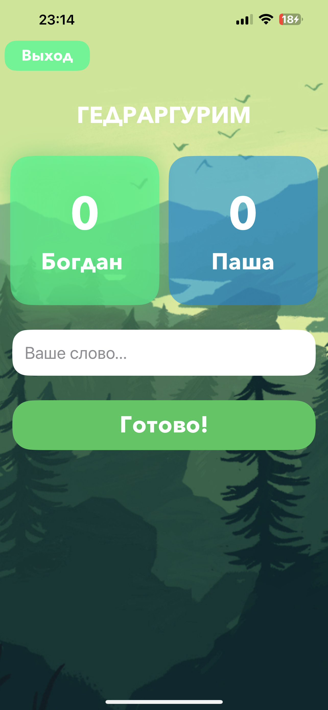
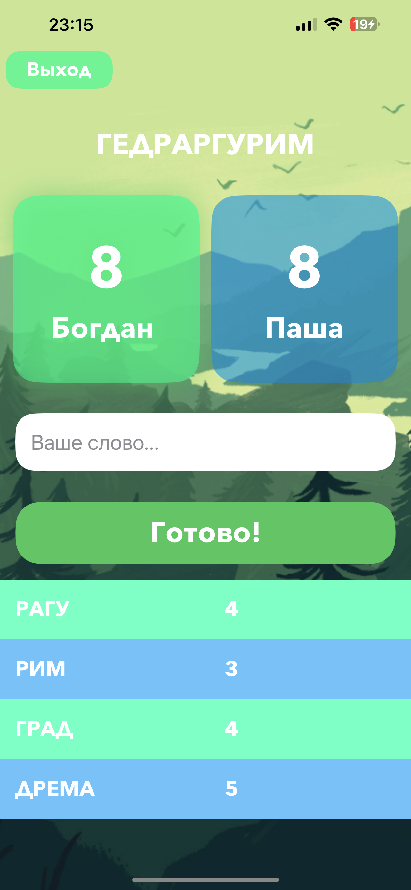

# WordsGame
Небольшая игра слов на iPhone на писанный на swift и swiftUI, в чем чуть? Открываете игру, пишите имена игроков и длинное
слово, затем из длинного слова составляете другие слова, сколько букв в слове столько и балов получили.
Для того чтобы скачать игру нужно либо скачать zip файл, либо создать пустую папку открыть консоль в этой папку и прописать команду "git clone https://github.com/boshiro123/WordsGame.git"
Открываете проект в Xcode и запускаете.

